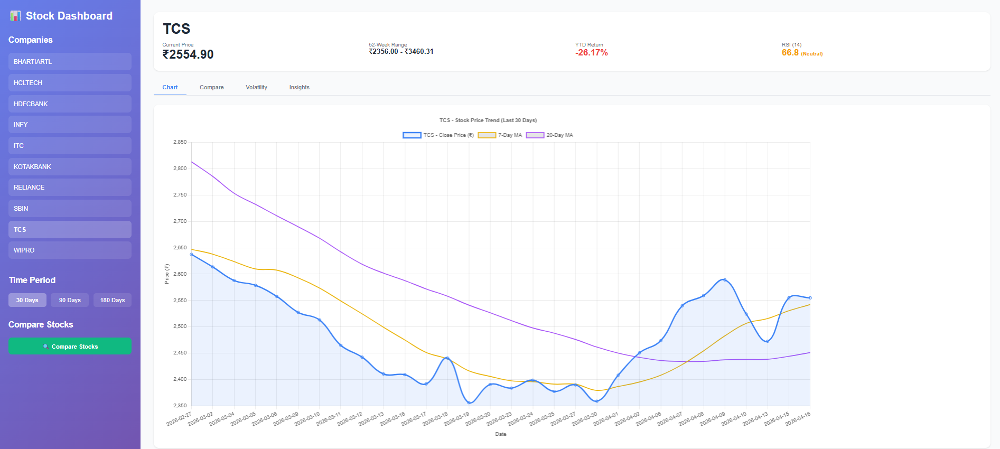
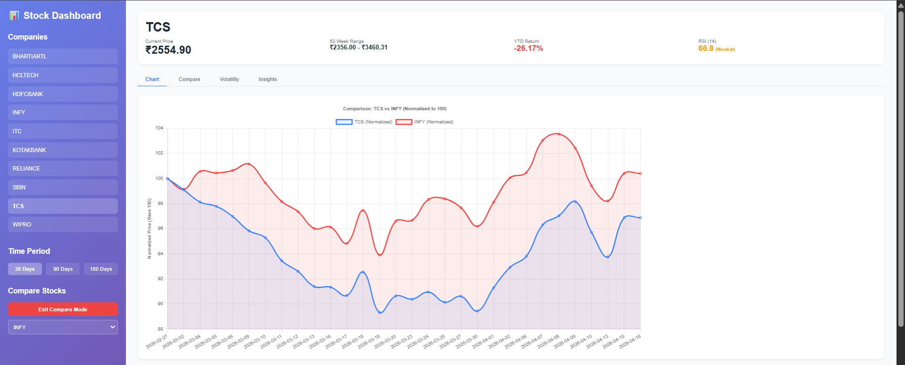

# 📊 Stock Data Intelligence Dashboard

A comprehensive full-stack stock market intelligence platform that provides real-time NSE stock data analysis, interactive visualizations, and advanced technical indicators. Built with FastAPI backend and React frontend.

## 🎯 Project Overview

This project fulfills the internship assignment requirements by demonstrating proficiency in:
- Real-time financial data collection and processing
- REST API development with comprehensive documentation
- Interactive data visualization and dashboard design
- Implementation of advanced financial metrics and indicators

## ✨ Features

### Data Processing & Analytics
| Feature | Description |
|---------|-------------|
| **Real Stock Data** | Fetches live NSE stock data via Yahoo Finance API |
| **Daily Returns** | Calculates daily percentage change (Close - Open)/Open |
| **Moving Averages** | 7-day and 20-day SMA for trend analysis |
| **52-Week Analysis** | High/Low tracking with current price positioning |
| **RSI Indicator** | 14-day Relative Strength Index (Overbought/Oversold signals) |
| **Volatility Score** | Daily price fluctuation measurement with trend analysis |
| **Price Position** | Current price location within 52-week range (0-100%) |
| **Correlation Matrix** | Pairwise correlation between multiple stocks |

### Backend APIs (8 Endpoints)
| Endpoint | Method | Description |
|----------|--------|-------------|
| `/` | GET | API information and available endpoints |
| `/companies` | GET | List of all available stocks |
| `/data/{symbol}` | GET | Historical data with date filters (30-365 days) |
| `/summary/{symbol}` | GET | Key metrics: 52W high/low, RSI, YTD returns |
| `/compare` | GET | Side-by-side stock comparison with correlation |
| `/top-gainers` | GET | Daily best and worst performing stocks |
| `/volatility/{symbol}` | GET | Volatility metrics with increasing/decreasing trend |
| `/correlation` | GET | Correlation matrix for selected symbols |
| `/stats/{symbol}` | GET | Advanced statistics: Sharpe ratio, max drawdown |

### Frontend Dashboard
- **Company Sidebar** - Quick access to all 10 NSE stocks
- **Interactive Price Chart** - Line chart with MA7/MA20 overlays
- **Time Period Filters** - 30/90/180 days view
- **Compare Mode** - Normalized chart for two stocks comparison
- **Top Gainers/Losers** - Daily market movers
- **Volatility Analysis Tab** - Risk assessment with trend indicators
- **Insights Tab** - AI-driven textual analysis (RSI + Price Position)
- **Responsive Design** - Works on desktop and tablet devices

### Technical Indicators (Bonus)
- ✅ Relative Strength Index (RSI)
- ✅ Volatility Scoring
- ✅ Sharpe Ratio
- ✅ Maximum Drawdown
- ✅ Price Correlation
- ✅ Year-to-Date Returns

## 🛠️ Technology Stack

### Backend
- Python 3.9+
- FastAPI (Web framework)
- SQLite3 (Database)
- yfinance (Market data)
- Pandas (Data processing)
- NumPy (Numerical computations)
- Uvicorn (ASGI server)

### 🎨 Frontend
- React 18
- Chart.js (Data visualizations)
- Axios (HTTP client for API calls)
- CSS3 (Styling)

### 🧰 Development Tools
- Git (Version control)
- Swagger / OpenAPI (API documentation)
- Postman (API testing - optional)

## 📦 Installation & Setup

### Prerequisites
```bash
# Check Python version
python --version  # Required: 3.9+

# Check Node.js version
node --version    # Required: 16+

# Check npm version
npm --version     # Required: 8+

```

## ⚙️ Backend Setup

```bash
# 1. Clone the repository
git clone https://github.com/yourusername/stock-dashboard.git
cd stock-dashboard

# 2. Navigate to backend
cd backend

# 3. Create virtual environment (recommended)
python -m venv venv

# Activate virtual environment
# Windows:
venv\Scripts\activate
# Mac/Linux:
source venv/bin/activate

# 4. Install dependencies
pip install -r requirements.txt

# 5. Run the server
python main.py

# Server runs at: http://localhost:8000
# API Documentation: http://localhost:8000/docs
```

## 🎨 Frontend Setup

```bash
# 1. Open new terminal, navigate to frontend
cd frontend

# 2. Install dependencies
npm install

# 3. Start the development server
npm start

# App runs at: http://localhost:3000
```

## 🔐 Environment Configuration

Create a `.env` file in the frontend directory (optional):

```env
REACT_APP_API_URL=http://localhost:8000
```

## 📸 Screenshots

### Main Dashboard


### Compare Mode



## 🚀 API Usage Examples

### 📊 Get All Companies

```bash
curl http://localhost:8000/companies
```
### 📥 Response

```json
["INFY", "TCS", "RELIANCE", "HDFCBANK", "ITC", "WIPRO", "HCLTECH", "SBIN", "BHARTIARTL", "KOTAKBANK"]

```

## 📈 Get Stock Data (Last 30 Days)

### 📡 Request
```bash
curl "http://localhost:8000/data/INFY?days=30"
```
### 📥 Response

```json
[
  {
    "Date": "2025-04-14",
    "Close": 1423.50,
    "Open": 1418.75,
    "High": 1428.90,
    "Low": 1415.20,
    "Volume": 2456789,
    "Daily_Return": 0.00335,
    "MA7": 1415.30,
    "MA20": 1405.60,
    "Volatility": 0.0096
  }
]

```

## 📊 Compare Two Stocks

### 📡 Request
```bash
curl "http://localhost:8000/compare?symbol1=INFY&symbol2=TCS&period=30d"
```
### 📥 Response

```json
{
  "symbol1": {
    "name": "INFY",
    "total_return": 12.5,
    "avg_daily_return": 0.42
  },
  "symbol2": {
    "name": "TCS",
    "total_return": 10.2,
    "avg_daily_return": 0.34
  },
  "correlation": 0.85,
  "better_performer": "INFY"
}

```

## 📊 Get Stock Summary

### 📡 Request
```bash
curl "http://localhost:8000/summary/RELIANCE"
```
### 📥 Response

```json
{
  "symbol": "RELIANCE",
  "current_price": 2456.30,
  "52_week_high": 2850.00,
  "52_week_low": 2100.00,
  "average_close": 2475.20,
  "total_return_ytd": 8.45,
  "current_rsi": 55.2,
  "price_position": 0.62
}
```

## 📈 Get Top Gainers

### 📡 Request
```bash
curl "http://localhost:8000/top-gainers?limit=5"
```

## 📊 Calculated Metrics - Formulas

| Metric | Formula | Description |
|--------|--------|-------------|
| Daily Return | (Close - Open) / Open × 100% | Daily percentage change |
| 7-Day MA | Sum(Last 7 Closes) / 7 | Short-term trend indicator |
| 20-Day MA | Sum(Last 20 Closes) / 20 | Medium-term trend indicator |
| 52-Week High | Max(Last 252 Closes) | Highest price in 1 year |
| 52-Week Low | Min(Last 252 Closes) | Lowest price in 1 year |
| RSI (14) | 100 - (100 / (1 + RS)) | Momentum oscillator (0-100) |
| Volatility | (High - Low) / Open × 100% | Daily price fluctuation |
| Price Position | (Current - 52L) / (52H - 52L) × 100% | Position in 52-week range |
| Sharpe Ratio | (Mean Return / Std Return) × √252 | Risk-adjusted returns |
| Max Drawdown | Min((Cumulative Peak - Valley) / Peak) | Worst peak-to-trough decline |


## 📁 Project Structure

```text
stock-dashboard/
├── backend/
│   ├── main.py              # FastAPI application
│   ├── requirements.txt     # Python dependencies
│   ├── stocks.db            # SQLite database (auto-generated)
│   └── README.md            # Backend documentation
├── frontend/
│   ├── src/
│   │   └── App.js           # Main React component
│   ├── public/
│   ├── package.json         # Node dependencies
│   └── README.md            # Frontend documentation
└── README.md                # This file

```

## 📈 Performance Optimizations

- **Data Caching** - SQLite database stores data and refreshes only when outdated  
- **Efficient Queries** - Parameterized SQL queries with proper indexing  
- **Frontend Memoization** - `useCallback` hooks prevent unnecessary re-renders  
- **Lazy Loading** - Charts render only when the tab is active  

## 👨‍💻 Author

- **D K VIJENDRA KUMAR** 
- GitHub: https://github.com/dk9480 


## 🙏 Acknowledgments

- Yahoo Finance for providing stock market data API  
- FastAPI for excellent framework documentation  
- React and Chart.js communities  


